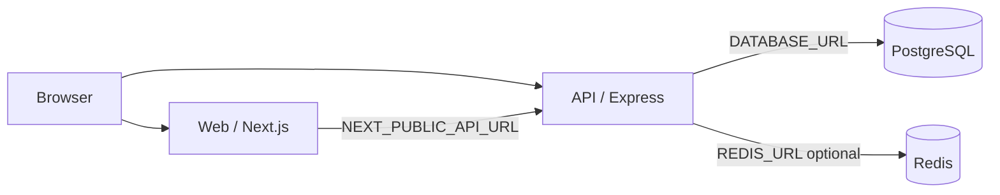
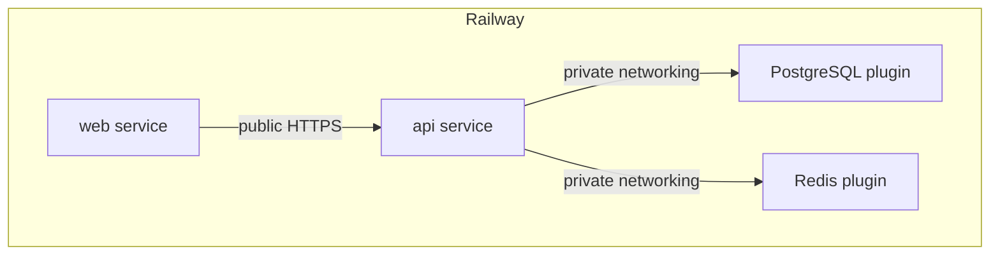

# Production Full-Stack SaaS Starter

A production-oriented full-stack starter for developers who want a Next.js frontend, Node.js API, PostgreSQL database, Redis infrastructure, authentication, and Railway deployment in one reusable architecture.

This repository is intentionally generic. It is a clean foundation for SaaS apps, dashboards, admin panels, APIs, internal tools, and real-time or AI-backed products — not a finished vertical product.

## Stack

| Layer | Technology |
|-------|------------|
| Frontend | Next.js (App Router), TypeScript |
| Backend | Node.js, Express, TypeScript |
| Database | PostgreSQL + Prisma ORM |
| Cache / jobs | Redis (optional at startup) |
| Auth | Email/password, bcrypt hashing, JWT access tokens, refresh tokens |
| Deploy | Railway, Docker |

## Architecture



Recommended Railway topology:



## Repository structure

```text
/
├── apps/
│   ├── web/                 # Next.js frontend
│   └── api/                 # Express REST API
├── packages/
│   ├── shared/              # Shared types/helpers
│   └── config/              # Shared ESLint/config helpers
├── prisma/                  # Schema, migrations, seed
├── docker/                  # Extra Dockerfiles
├── scripts/                 # Setup and startup helpers
├── .env.example
├── docker-compose.yml
├── Dockerfile               # API production image
├── railway.json             # API Railway config (release migrations + health)
├── railway.web.json         # Web Railway config (root convenience copy)
├── RAILWAY_TEMPLATE.md      # Marketplace / Template Composer guide
├── package.json
├── README.md
└── LICENSE
```

`apps/web/railway.json` is the Config-as-Code file for the `web` service.

## Features

- Secure registration and login with hashed passwords
- JWT access tokens and rotating refresh tokens
- Protected API routes and protected dashboard
- Health endpoint plus optional diagnostics for database/Redis
- Redis-backed caching, rate-limit friendly design, and a simple queue example
- CORS, Helmet security headers, request logging, validation, graceful shutdown
- Docker Compose for local Postgres and Redis
- Railway-oriented env wiring and health checks

## Quick start (local)

### Prerequisites

- Node.js 20+
- npm 10+
- Docker Desktop (for Postgres and Redis)

### 1. Clone

```bash
git clone https://github.com/shanu222/template-for-railway.git
cd template-for-railway
```

### 2. Install dependencies

```bash
npm install
```

### 3. Start PostgreSQL and Redis

```bash
npm run docker:up
```

### 4. Configure environment

```bash
npm run setup
# or: cp .env.example .env
```

Edit `.env` if needed. For local development the defaults match `docker-compose.yml`.  
`npm run setup` generates a local `JWT_SECRET` — never commit `.env`.

### 5. Run Prisma migrations

```bash
npm run db:migrate:dev
```

### 6. Seed the database (local/demo only)

```bash
npm run db:seed
```

Seed creates **development/demo data only**. It refuses to run when `NODE_ENV=production` unless `ALLOW_PROD_SEED=true`.  
Default local demo user (override with env vars):

- Email: `demo@example.com`
- Password: from `SEED_USER_PASSWORD` in `.env.example`

### 7. Start the API

```bash
npm run dev:api
```

API defaults to `http://localhost:4000`.

### 8. Start the Next.js frontend

```bash
npm run dev:web
```

Web defaults to `http://localhost:3000`.

Or run both:

```bash
npm run dev
```

## Environment variables

### Local development

| Variable | Required | Description |
|----------|----------|-------------|
| `DATABASE_URL` | Yes | PostgreSQL connection string |
| `REDIS_URL` | No | Redis connection string; enables cache/queue examples |
| `JWT_SECRET` | Yes | Secret for signing JWTs (min 32 chars). Generate locally via `npm run setup` |
| `JWT_EXPIRES_IN` | No | Access token lifetime (default `15m`) |
| `JWT_REFRESH_EXPIRES_IN` | No | Refresh token lifetime (default `7d`) |
| `NEXT_PUBLIC_API_URL` | Yes (web) | Browser-reachable API base URL (needed at Next.js **build** time) |
| `CORS_ORIGIN` | Yes (prod) | Allowed frontend origin(s), comma-separated |
| `PORT` | No | API listen port (Railway injects this in deploy) |
| `NODE_ENV` | No | `development` / `test` / `production` |
| `BCRYPT_SALT_ROUNDS` | No | Password hash cost (default `12`) |
| `RATE_LIMIT_WINDOW_MS` | No | Rate-limit window |
| `RATE_LIMIT_MAX` | No | General request limit |
| `AUTH_RATE_LIMIT_MAX` | No | Auth endpoint limit |

See [`.env.example`](./.env.example) for placeholders only. Never commit real credentials.

### Railway (reference + generated variables)

| Variable | Service | Value |
|----------|---------|-------|
| `DATABASE_URL` | `api` | `${{Postgres.DATABASE_URL}}` |
| `REDIS_URL` | `api` | `${{Redis.REDIS_URL}}` |
| `JWT_SECRET` | `api` | `${{secret(64)}}` (auto-generated; never hardcode) |
| `CORS_ORIGIN` | `api` | `https://${{web.RAILWAY_PUBLIC_DOMAIN}}` |
| `NEXT_PUBLIC_API_URL` | `web` | `https://${{api.RAILWAY_PUBLIC_DOMAIN}}` |
| `NODE_ENV` | `api`, `web` | `production` |

Full Template Composer settings: [`RAILWAY_TEMPLATE.md`](./RAILWAY_TEMPLATE.md).

## API endpoints

| Method | Path | Auth | Description |
|--------|------|------|-------------|
| `GET` | `/api/health` | No | Lightweight health check `{ "status": "ok" }` |
| `GET` | `/api/health/diagnostics` | No | API/DB/Redis diagnostics (does not fail health) |
| `GET` | `/api` | No | API information |
| `POST` | `/api/auth/register` | No | Create account |
| `POST` | `/api/auth/login` | No | Login |
| `GET` | `/api/auth/me` | Bearer | Current user |
| `POST` | `/api/auth/logout` | Optional | Revoke refresh token / clear session |
| `POST` | `/api/auth/refresh` | No | Exchange refresh token for new tokens |
| `GET` | `/api/status` | Bearer | Connection status for dashboard |

### Example register body

```json
{
  "name": "Ada Lovelace",
  "email": "ada@example.com",
  "password": "SecurePass123"
}
```

Passwords are hashed with bcrypt. Plaintext passwords and password hashes are never returned by the API.

## Authentication model

1. Client registers or logs in with email/password.
2. API returns an access JWT and a refresh token.
3. Protected routes require `Authorization: Bearer <accessToken>`.
4. Refresh tokens are stored hashed in PostgreSQL and can be revoked on logout.
5. Frontend stores tokens in `localStorage` for the starter dashboard; replace with your preferred session strategy for stricter threat models.

## Database

Prisma models:

- `User` — id, name, email, passwordHash, timestamps
- `RefreshToken` — hashed refresh token, expiry, revoke timestamp

Commands:

```bash
npm run db:generate
npm run db:migrate:dev
npm run db:migrate
npm run db:seed
npm run db:studio
npm run db:validate
```

## Redis

Redis is optional for basic API startup.

When `REDIS_URL` is set, the API demonstrates:

- short-lived user profile caching
- a simple list-based job enqueue helper
- connection diagnostics for the dashboard

If Redis is unavailable, the API still serves health and auth against PostgreSQL.

## Railway deployment

Marketplace-oriented configuration lives in [`RAILWAY_TEMPLATE.md`](./RAILWAY_TEMPLATE.md).

### Architecture on Railway

| Service | Root directory | Public networking | Role |
|---------|----------------|-------------------|------|
| `web` | `/` (repo root) | Yes | Next.js UI |
| `api` | `/` (repo root) | Yes | Express API |
| `Postgres` | plugin | **No** | Database via private networking |
| `Redis` | plugin | **No** | Cache/queue via private networking |

Both app services use the **repository root** as Root Directory (npm workspaces + shared Prisma). Config-as-code:

- `api` → `/railway.json`
- `web` → `/apps/web/railway.json`

### Private networking

- Browser → `web` / `api` over **public HTTPS** (required because `NEXT_PUBLIC_API_URL` is a client-side variable)
- `api` → Postgres / Redis over **Railway private networking** through plugin URLs
- Do not enable public networking on Postgres or Redis

### API service variables

```text
DATABASE_URL=${{Postgres.DATABASE_URL}}
REDIS_URL=${{Redis.REDIS_URL}}
JWT_SECRET=${{secret(64)}}
JWT_EXPIRES_IN=15m
JWT_REFRESH_EXPIRES_IN=7d
CORS_ORIGIN=https://${{web.RAILWAY_PUBLIC_DOMAIN}}
NODE_ENV=production
```

- Health check: `/api/health`
- Start command: `node apps/api/dist/index.js`
- Listens on `process.env.PORT` (injected by Railway)

### Web service variables

```text
NEXT_PUBLIC_API_URL=https://${{api.RAILWAY_PUBLIC_DOMAIN}}
NODE_ENV=production
```

- Health check: `/`
- Dockerfile: `docker/Dockerfile.web`
- `NEXT_PUBLIC_API_URL` must be present at **build time**; rebuild `web` if the API domain changes
- Do not hardcode a Railway public domain

### Database migrations on Railway

Migrations run **once per deploy** via the API service `releaseCommand` in `railway.json`:

```text
npx prisma migrate deploy --schema=prisma/schema.prisma
```

They are **not** executed on every container/replica start. That avoids migration races when scaling replicas.

Local production-style migrate:

```bash
npm run db:migrate
```

Do not seed on Railway as part of deploy. Seed is local/demo only.

### After deploy

1. Confirm `GET https://<api-public-domain>/api/health` returns `{ "status": "ok" }`.
2. Open the web public URL and register a user (no demo login required).
3. Verify the dashboard shows API/database status (and Redis when configured).

## Docker

Local dependencies:

```bash
docker compose up -d
```

Production API image (repo root):

```bash
docker build -t saas-starter-api .
```

Production web image:

```bash
docker build -f docker/Dockerfile.web --build-arg NEXT_PUBLIC_API_URL=https://your-api.example.com -t saas-starter-web .
```

Images use multi-stage builds, production Node, and non-root users where practical.

## Scripts

| Command | Purpose |
|---------|---------|
| `npm run setup` | Create `.env` with generated `JWT_SECRET` |
| `npm run docker:up` | Start Postgres + Redis |
| `npm run dev` | Run API + web |
| `npm run build` | Production builds |
| `npm run lint` | Lint API + web |
| `npm run typecheck` | TypeScript checks |
| `npm test` | API unit/smoke-style tests |
| `npm run db:validate` | Validate Prisma schema |

## Frontend pages

| Route | Purpose |
|-------|---------|
| `/` | Starter homepage and stack overview |
| `/login` | Login |
| `/register` | Registration |
| `/dashboard` | Authenticated user + connection status |

## Troubleshooting

**API fails on boot with env validation errors**  
Ensure `.env` exists and `DATABASE_URL` / `JWT_SECRET` are set. `JWT_SECRET` must be at least 32 characters.

**Database connection errors**  
Confirm Docker Compose is running and `DATABASE_URL` points to `localhost:5432` locally.

**Redis shows skipped/down**  
Expected when `REDIS_URL` is unset or Redis is offline. Auth still works with PostgreSQL.

**CORS errors in the browser**  
Set `CORS_ORIGIN` to the exact frontend origin, including protocol.

**Frontend cannot reach API**  
Check `NEXT_PUBLIC_API_URL` and rebuild the web app after changing it.

**Prisma migrate fails on Railway**  
Confirm the API service has `DATABASE_URL=${{Postgres.DATABASE_URL}}`, private networking to Postgres works, and `releaseCommand` is set (see `railway.json`).

**Web build has wrong/empty API URL**  
`NEXT_PUBLIC_API_URL` must be set on the `web` service before build, then rebuild. Client bundles do not pick up runtime-only changes to `NEXT_PUBLIC_*`.

## Production deployment checklist

- [ ] `JWT_SECRET=${{secret(64)}}` (not hardcoded, not committed)
- [ ] `DATABASE_URL=${{Postgres.DATABASE_URL}}`
- [ ] `REDIS_URL=${{Redis.REDIS_URL}}`
- [ ] `CORS_ORIGIN=https://${{web.RAILWAY_PUBLIC_DOMAIN}}`
- [ ] `NEXT_PUBLIC_API_URL=https://${{api.RAILWAY_PUBLIC_DOMAIN}}`
- [ ] Postgres and Redis not publicly exposed
- [ ] API health check `/api/health`; web health check `/`
- [ ] Migrations via `releaseCommand` only (not per-replica start)
- [ ] Seed not run in production deploys
- [ ] Review rate limits and cookie/SameSite settings for your domain setup

## Quality commands

```bash
npm install
npm run typecheck
npm run lint
npm test
npm run db:validate
npm run build
```

## License

MIT — see [LICENSE](./LICENSE).

## Marketplace summary

See [`RAILWAY_TEMPLATE.md`](./RAILWAY_TEMPLATE.md) for the full Composer checklist.

**Name:** Production Full-Stack SaaS Starter  
**Description:** Deploy a reusable full-stack starter with Next.js, Node.js, PostgreSQL, Prisma, Redis, authentication, and Railway-ready infrastructure.  
**Category:** Starters  
**Tags:** Next.js, Node.js, TypeScript, PostgreSQL, Redis, Prisma, SaaS, Authentication, REST API, Full Stack
