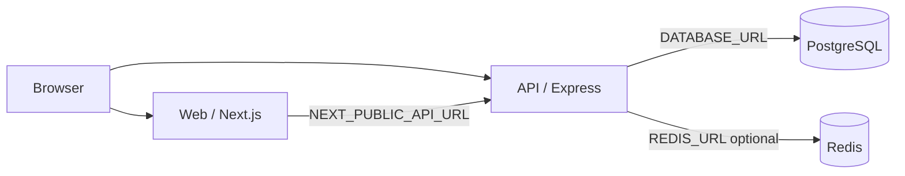
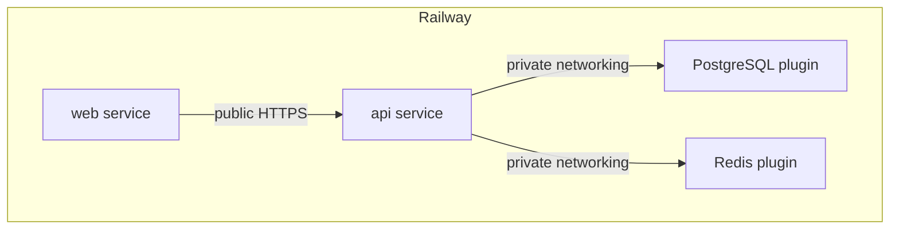

# Production Full-Stack SaaS Starter

A production-oriented full-stack starter for developers who want a Next.js frontend, Node.js API, PostgreSQL database, Redis infrastructure, authentication, and Railway deployment in one reusable architecture.

This repository is intentionally generic. It is a clean foundation for SaaS apps, dashboards, admin panels, APIs, internal tools, and real-time or AI-backed products — not a finished vertical product.

## Stack

| Layer | Technology |
|-------|------------|
| Frontend | Next.js (App Router), TypeScript |
| Backend | Node.js, Express, TypeScript |
| Database | PostgreSQL + Prisma ORM |
| Cache / jobs | Redis (optional at startup) |
| Auth | Email/password, bcrypt hashing, JWT access tokens, refresh tokens |
| Deploy | Railway, Docker |

## Architecture



Recommended Railway topology:



## Repository structure

```text
/
├── apps/
│   ├── web/                 # Next.js frontend
│   └── api/                 # Express REST API
├── packages/
│   ├── shared/              # Shared types/helpers
│   └── config/              # Shared ESLint/config helpers
├── prisma/                  # Schema, migrations, seed
├── docker/                  # Extra Dockerfiles
├── scripts/                 # Setup and startup helpers
├── .env.example
├── docker-compose.yml
├── Dockerfile               # API production image
├── railway.json
├── package.json
├── README.md
└── LICENSE
```

## Features

- Secure registration and login with hashed passwords
- JWT access tokens and rotating refresh tokens
- Protected API routes and protected dashboard
- Health endpoint plus optional diagnostics for database/Redis
- Redis-backed caching, rate-limit friendly design, and a simple queue example
- CORS, Helmet security headers, request logging, validation, graceful shutdown
- Docker Compose for local Postgres and Redis
- Railway-oriented env wiring and health checks

## Quick start (local)

### Prerequisites

- Node.js 20+
- npm 10+
- Docker Desktop (for Postgres and Redis)

### 1. Clone

```bash
git clone <your-repo-url> railway-fullstack-saas-starter
cd railway-fullstack-saas-starter
```

### 2. Install dependencies

```bash
npm install
```

### 3. Start PostgreSQL and Redis

```bash
npm run docker:up
```

### 4. Configure environment

```bash
npm run setup
# or: cp .env.example .env
```

Edit `.env` if needed. For local development the defaults match `docker-compose.yml`.

### 5. Run Prisma migrations

```bash
npm run db:migrate:dev
```

### 6. Seed the database

```bash
npm run db:seed
```

Default seed user (override with env vars):

- Email: `demo@example.com`
- Password: `DemoPassword123!`

### 7. Start the API

```bash
npm run dev:api
```

API defaults to `http://localhost:4000`.

### 8. Start the Next.js frontend

```bash
npm run dev:web
```

Web defaults to `http://localhost:3000`.

Or run both:

```bash
npm run dev
```

## Environment variables

| Variable | Required | Description |
|----------|----------|-------------|
| `DATABASE_URL` | Yes | PostgreSQL connection string |
| `REDIS_URL` | No | Redis connection string; enables cache/queue examples |
| `JWT_SECRET` | Yes | Secret for signing JWTs (min 32 chars) |
| `JWT_EXPIRES_IN` | No | Access token lifetime (default `15m`) |
| `JWT_REFRESH_EXPIRES_IN` | No | Refresh token lifetime (default `7d`) |
| `NEXT_PUBLIC_API_URL` | Yes (web) | Browser-reachable API base URL |
| `CORS_ORIGIN` | Yes (prod) | Allowed frontend origin(s), comma-separated |
| `PORT` | No | API listen port (Railway injects this) |
| `NODE_ENV` | No | `development` / `test` / `production` |
| `BCRYPT_SALT_ROUNDS` | No | Password hash cost (default `12`) |
| `RATE_LIMIT_WINDOW_MS` | No | Rate-limit window |
| `RATE_LIMIT_MAX` | No | General request limit |
| `AUTH_RATE_LIMIT_MAX` | No | Auth endpoint limit |

See [`.env.example`](./.env.example) for placeholders only. Never commit real credentials.

## API endpoints

| Method | Path | Auth | Description |
|--------|------|------|-------------|
| `GET` | `/api/health` | No | Lightweight health check `{ "status": "ok" }` |
| `GET` | `/api/health/diagnostics` | No | API/DB/Redis diagnostics (does not fail health) |
| `GET` | `/api` | No | API information |
| `POST` | `/api/auth/register` | No | Create account |
| `POST` | `/api/auth/login` | No | Login |
| `GET` | `/api/auth/me` | Bearer | Current user |
| `POST` | `/api/auth/logout` | Optional | Revoke refresh token / clear session |
| `POST` | `/api/auth/refresh` | No | Exchange refresh token for new tokens |
| `GET` | `/api/status` | Bearer | Connection status for dashboard |

### Example register body

```json
{
  "name": "Ada Lovelace",
  "email": "ada@example.com",
  "password": "SecurePass123"
}
```

Passwords are hashed with bcrypt. Plaintext passwords and password hashes are never returned by the API.

## Authentication model

1. Client registers or logs in with email/password.
2. API returns an access JWT and a refresh token.
3. Protected routes require `Authorization: Bearer <accessToken>`.
4. Refresh tokens are stored hashed in PostgreSQL and can be revoked on logout.
5. Frontend stores tokens in `localStorage` for the starter dashboard; replace with your preferred session strategy for stricter threat models.

## Database

Prisma models:

- `User` — id, name, email, passwordHash, timestamps
- `RefreshToken` — hashed refresh token, expiry, revoke timestamp

Commands:

```bash
npm run db:generate
npm run db:migrate:dev
npm run db:migrate
npm run db:seed
npm run db:studio
npm run db:validate
```

## Redis

Redis is optional for basic API startup.

When `REDIS_URL` is set, the API demonstrates:

- short-lived user profile caching
- a simple list-based job enqueue helper
- connection diagnostics for the dashboard

If Redis is unavailable, the API still serves health and auth against PostgreSQL.

## Railway deployment

Marketplace metadata lives in [`RAILWAY_TEMPLATE.md`](./RAILWAY_TEMPLATE.md).

### Create services

1. Create a Railway project from this repository.
2. Add four services/plugins:
   - **web** (Next.js)
   - **api** (Express)
   - **PostgreSQL**
   - **Redis**
3. Keep PostgreSQL and Redis private (no public networking).

### API service settings

- Root directory: `/`
- Dockerfile: `Dockerfile` (or Builder Dockerfile)
- Health check path: `/api/health`
- Start command (Docker CMD already runs migrations): `./scripts/start-api.sh`

Variables:

```text
DATABASE_URL=${{Postgres.DATABASE_URL}}
REDIS_URL=${{Redis.REDIS_URL}}
JWT_SECRET=<generate with Railway>
JWT_EXPIRES_IN=15m
JWT_REFRESH_EXPIRES_IN=7d
CORS_ORIGIN=https://${{web.RAILWAY_PUBLIC_DOMAIN}}
NODE_ENV=production
```

Railway provides `PORT` automatically. The API listens on `process.env.PORT`.

### Web service settings

- Dockerfile: `docker/Dockerfile.web`
- Or Nixpacks/Node with start command `npm run start -w @app/web`

Variables:

```text
NEXT_PUBLIC_API_URL=https://${{api.RAILWAY_PUBLIC_DOMAIN}}
NODE_ENV=production
```

Build argument / env note: `NEXT_PUBLIC_API_URL` must be available at build time for the Next.js client bundle.

### After deploy

1. Confirm `GET https://<api-domain>/api/health` returns `{ "status": "ok" }`.
2. Open the web URL and register a user.
3. Verify the dashboard shows API/database status (and Redis when configured).

## Docker

Local dependencies:

```bash
docker compose up -d
```

Production API image (repo root):

```bash
docker build -t saas-starter-api .
```

Production web image:

```bash
docker build -f docker/Dockerfile.web --build-arg NEXT_PUBLIC_API_URL=https://your-api.example.com -t saas-starter-web .
```

Images use multi-stage builds, production Node, and non-root users where practical.

## Scripts

| Command | Purpose |
|---------|---------|
| `npm run setup` | Create `.env` with generated `JWT_SECRET` |
| `npm run docker:up` | Start Postgres + Redis |
| `npm run dev` | Run API + web |
| `npm run build` | Production builds |
| `npm run lint` | Lint API + web |
| `npm run typecheck` | TypeScript checks |
| `npm test` | API unit/smoke-style tests |
| `npm run db:validate` | Validate Prisma schema |

## Frontend pages

| Route | Purpose |
|-------|---------|
| `/` | Starter homepage and stack overview |
| `/login` | Login |
| `/register` | Registration |
| `/dashboard` | Authenticated user + connection status |

## Troubleshooting

**API fails on boot with env validation errors**  
Ensure `.env` exists and `DATABASE_URL` / `JWT_SECRET` are set. `JWT_SECRET` must be at least 32 characters.

**Database connection errors**  
Confirm Docker Compose is running and `DATABASE_URL` points to `localhost:5432` locally.

**Redis shows skipped/down**  
Expected when `REDIS_URL` is unset or Redis is offline. Auth still works with PostgreSQL.

**CORS errors in the browser**  
Set `CORS_ORIGIN` to the exact frontend origin, including protocol.

**Frontend cannot reach API**  
Check `NEXT_PUBLIC_API_URL` and rebuild the web app after changing it.

**Prisma migrate fails on Railway**  
Confirm the API service has `DATABASE_URL` from the Postgres plugin and can reach it over private networking.

## Production deployment checklist

- [ ] Strong unique `JWT_SECRET` generated (not committed)
- [ ] `DATABASE_URL` from Railway Postgres reference variable
- [ ] `REDIS_URL` from Railway Redis reference variable (recommended)
- [ ] `CORS_ORIGIN` set to the deployed web URL
- [ ] `NEXT_PUBLIC_API_URL` set to the deployed API URL
- [ ] Postgres and Redis not publicly exposed
- [ ] API health check configured to `/api/health`
- [ ] Migrations run on deploy (`scripts/start-api.sh`)
- [ ] Seed only used for demos; disable or change defaults in production
- [ ] Review rate limits and cookie/SameSite settings for your domain setup

## Quality commands

```bash
npm install
npm run typecheck
npm run lint
npm test
npm run db:validate
npm run build
```

## License

MIT — see [LICENSE](./LICENSE).

## Marketplace summary

**Name:** Production Full-Stack SaaS Starter  
**Short description:** Deploy a full-stack Next.js and Node.js application with PostgreSQL, Prisma, Redis, authentication, and Railway-ready infrastructure.  
**Category:** Starters / Full Stack  
**Tags:** Next.js, Node.js, TypeScript, PostgreSQL, Redis, Prisma, SaaS, Full Stack, Authentication, REST API
